## Abstract

The stock market has huge potential for experimenting with deep learning. If one is able to accurately predict future stock prices, a lot of money can be made. In this project we compare different model architectures and their ability to forecast the stock market in the hopes of finding out which model architectures are the best.

## Problem Statement

For our final project, we analyze 2 single-shot prediction models: an LSTM model, and a convolutional model, as well as an autogregressive LSTM model, to see which model, given only historical data of a particular stock, performs the best in predicting future stock prices. We hypothesize that despite many claims against being able to make accurate stock price predictions, we will be able to come up with a (relatively) simple model that might give some direction into the trend of a stock price for the coming days.


## Related Work

There's various research out there regarding stock price prediction. One paper that uses very similar methods to what we do and acts as our inspiration for this project can be found [here](https://arxiv.org/ftp/arxiv/papers/2009/2009.10819.pdf). This paper most pertains to lstm and single day prediction. Our final project is also inspired by TensorFlow's time series forecasting tutorial. We use similar methodolgy from this tutorial to go about testing various models and structuring our data. The link to this source can be found [here](https://www.tensorflow.org/tutorials/structured_data/time_series#multi-step_models).

## Methodology

We get all of our stock price data using yFinance, which is an open-source Python library that allows easy and free access to stock data from Yahoo Finance. We can request data for any company and any time period. The data includes features such as open price, closing price, the day's high, the day's low, the adjusted close, and volume, for any given date. To simplify, we only keep the "Closing price" (and date). Thus, we want our models to predict the future closing price of a given stock, using only historical closing price as input. In future work, it may be worthwhile to consider other features and their affects on the model's accuracy, although we suspect that they are all highly correlated and that including all the features are probably redundant. We have an example of yfinance data for a company here.

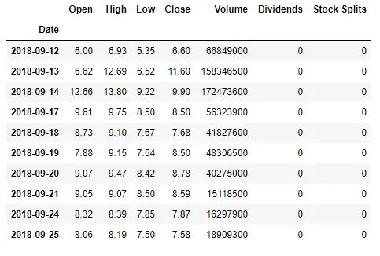

First, we pull all closing prices for AAPL (Apple Inc) between 2018-01-01 and 2022-12-15. We split the data into training, validation, and test sets using the ratios (70%, 20%, 10%). 

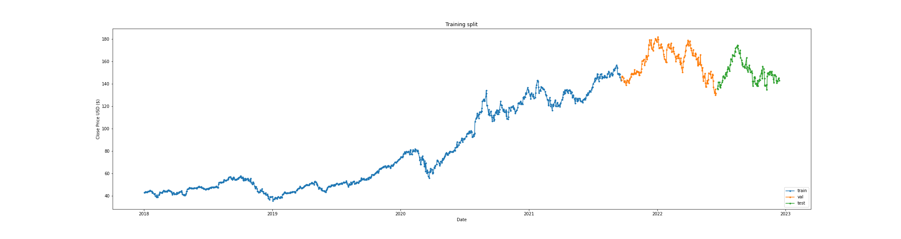

We do not shuffle the data before splitting to maintain it's orginal order, and to ensure that the validation and testing sets are collected after the training set, which mimics how one would use stock prediction models in the real world. 

We then normalize all data using the mean and standard deviation of the training set. In the future, it might be worthwhile to use rolling averages for this normalization process; however, in the interest of simplicity we use a simple average.

We then preprocess our training set into a format suitable for training. Since we want our models to take historical stock prices as input, and predict future stock prices as output, we have to use the same format during training: From our training set we create two sets, inputs (x) and labels (y). Each sample in our inputs consists of a window of consecutive samples from the data. The size of the window is a tunable parameter (INPUT_WIDTH), and defines how many consecutive days our models will use to make each prediction. Each sample in our labels set is also a window of consecutive sample from the data, where the window is of size LABEL_WIDTH, which defines how many days the model will predict for each prediction. Finally we also have parameter OFFSET which defines how many days into the future the predictions should be from the input. For simplicity we always used OFFSET=1.

For example, to make a single predicition (LABEL_WIDTH=1) one day (OFFSET=1) into the future, given six days of history (INPUT_WIDTH=6), we would need a window like this:


Note that a single pair input-output pair (input_0, labels_0) does not overlap between input and label, but subsequent training pairs overlap a lot, for example in addition to the training pair showed above, the next training pair would be ([1,2,3,4,5,6], [7]).

## Experiments/evaluation

The simplest model you can build is one that predicts a stock price a single day in the future. For this we decided to let the model use 30 days as input, and then predict the 31st day. The reason we decided to 30 days is because in reality, you would want as big input as possible to let the model learn as much as possible. However, the more days you use, the smaller your data sets become, and we found 30 to be a good middle ground.

We attempted to predict stock prices using 3 different models. Two were single-shot models, one a convultional neural network and the other an LSTM model. The third model was an autoregrissviev LSTM model. 

For the single-shot convoltional neural network, we used a model with a 1d convolutional layer with 256 filters and a kernel size of 3, and then a linear layer mapping to our output (label_width). The activation function we used was relu.

For our single-shot lstm network, we vertically stacked 3 LSTMs of 32 units each, and then mapped it to our label_width using 1 linear layer.

For our autoregressive lstm model, we use a single lstm layer. During prediction, the outputs get fed back into the model again, repeated label_width number of times.

For each model, we trained and evaluted only on a single stock at a time. For most parts, we used AAPL, but we also later retrained our models on other stock to confirm our results.

We noticed that when only predicting one day ahead, the convolutional and single-shot lstm models were relatively close in performance, so to try to clearly differentiate which model is best, we tried evaluating or model by predicting the AAPL stock for the next 2,4,8,16 and 32 days, given the last 30 days. 

Finally, we repeated the experiement for stock other than AAPL. This includes MSFT, GOOG, AMZN, META. For each stock, we also repeated the tests for our different label_widths.

## Results

While we discovered that the convolutional model performed the best on our data, we were initially surprised how badly all of our models seemed to perform in general. Overall, it seems all 3 models just look at the previous trend, and just assumes that the next stock price will follow that same trend. Our autorecurrent model, which we expected would perform the best, consistently predicted way too low prices, and was clearly the worst out of all. 

Here you can see the entire AAPL stock divided into training, validation and test. Overlayed on the test data are also a couple one day predictions for each of our model.

[](big1.png)

Zooming in, we can see our predictions don't start until a fair bit into the testing set, which is because we have our input_width set to 30. Each blue, magenta and red dot in the plot is a model predictions using the previous 30 greens dots as input.  

To evaluate the models, we can look at the plots, as well as evaluate the mean squared error on the validation and specificallly the test set. This tells us that our convolutional model performed the best.

```txt
lstm validation MSE: 0.00680
autoregressive validation MSE: 0.00114
convolution validation MSE: 0.00090
lstm test MSE: 0.00406
autoregressive test MSE: 0.00095
convolution test MSE: 0.00089
```

[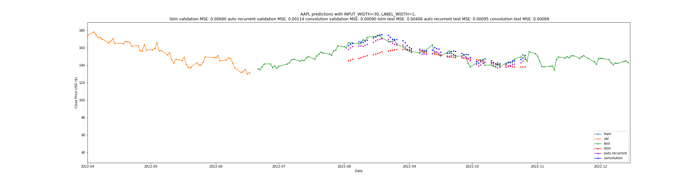](zoom1.png)


Similarly, we can look at the graph for when LABEL_WIDTH = 2

```txt
lstm validation MSE: 0.00679
autoregressive validation MSE: 0.00202
convolution validation MSE: 0.00109
lstm test MSE: 0.00405
autoregressive test MSE: 0.00144
convolution test MSE: 0.00101
```

[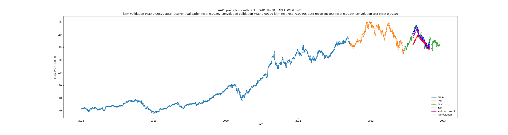](big2.png)
[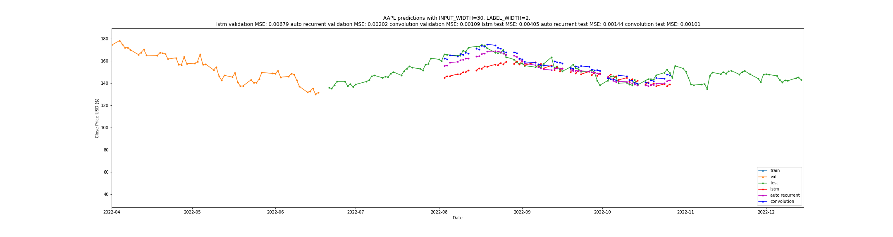](zoom2.png)

LABEL_WIDTH = 4


```txt
lstm validation MSE: 0.01110
autoregressive validation MSE: 0.00192
convolution validation MSE: 0.00160
lstm test MSE: 0.00618
autoregressive test MSE: 0.00177
convolution test MSE: 0.00130
```

[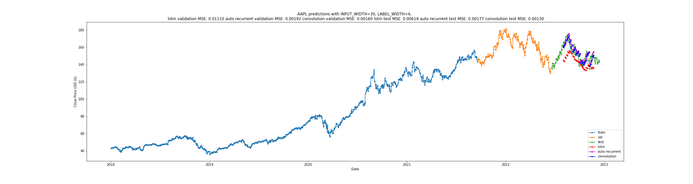](big4.png)
[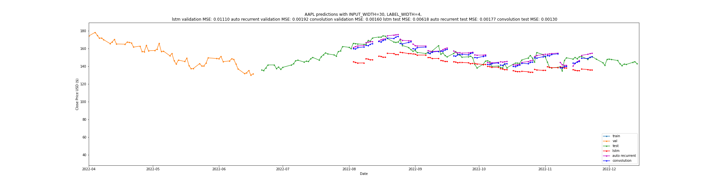](zoom4.png)

LABEL_WIDTH = 8


```txt
lstm validation MSE: 0.01037
autoregressive validation MSE: 0.00308
convolution validation MSE: 0.00328
lstm test MSE: 0.00474
autoregressive test MSE: 0.00317
convolution test MSE: 0.00220
```

[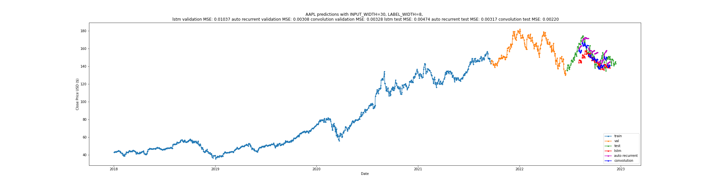](big8.png)
[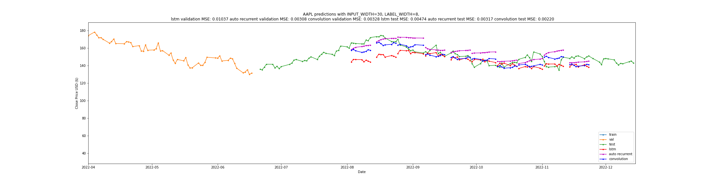](zoom8.png)

LABEL_WIDTH = 16


```txt
lstm validation MSE: 0.01502
autoregressive validation MSE: 0.00441
convolution validation MSE: 0.00422
lstm test MSE: 0.00549
autoregressive test MSE: 0.00394
convolution test MSE: 0.00258
```

[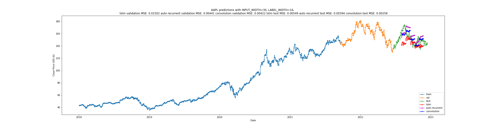](big16.png)
[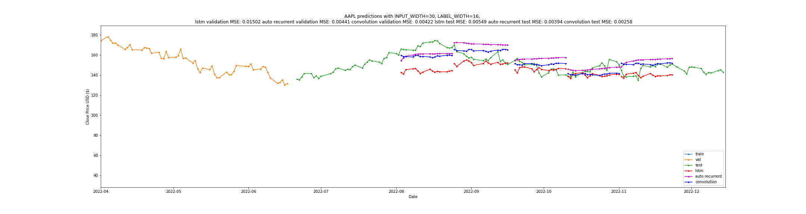](big16.png)

LABEL_WIDTH = 32


```txt
lstm validation MSE: 0.04082
autoregressive validation MSE: 0.01007
convolution validation MSE: 0.00734
lstm test MSE: 0.01377
autoregressive test MSE: 0.00494
convolution test MSE: 0.00342
```

[](big32.png)
[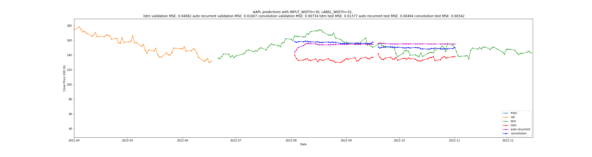](zoom32.png)

When retraining and testing our models against different stocks, not just AAPL, we found that our convolutional model consistently performed the best, regardless of which stock we used.

From our this, we conclude that predicting stock prices based purely on historical data is very hard, if not impossible. A stock price depends on so many more factors than just yesterday's price, so regardless of how deep and complex neural network you train, historical data is just not rich enough.

## Problems and Future Work

Yahoo finance is missing data for weekends. This makes our plots look slightly skewed, since samples are grouped into groups of 5. However, we don't think this caused any problems except making our graphs look slightly off.

Because of the limitations of only using historical data, we would like to in the future add more features as inputs, for example headlines from news articles, to see if this would help our models perform better. Sometimes stock prices changes drastically as a reaction to a breaking news article, so building a NLP model to help with stock prediction could potentially help alot.

Moreover, just looking at our predictions, we would like to compare all our models with a naive naive model which just predicts the same stock price as the input. This would provide a lot of insight, because it's possible the naive model might outright beat our neural networks (at least the autoregressive one). This is a theory we would like to test, but didn't have enough time to try and implement.

## Video

## Team Members

Tim Mandzyuk, Ludvig Liljenberg
