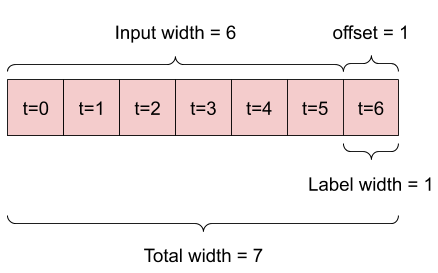

## Abstract

The stock market acts as an area with lots of potential for experimenting with deep learning to predict future stock prices. For our final project, we analyze various model architectures as well as experiment in many ways to see how we can make the best stock predicitor. The main goal of our final project was to properly do time series forecasting using a Recurrent Neural Network (RNN). There are two main parts we focus on. Firstly we  look at single time step forecast and then a more broad forecast, looking at multiple steps. 

## Problem Statement

Our project does not solve a problem, however it acts as an aid to those who would like to make good predictions for the stock market. We hypothesize that despite many claims against being able to make accurate stock price predictions, we would be able to come up with a model that might give some direction into the trend of a stock price for the coming days. We would like to focus on using a RNN-based deep learning model and building long and short-term memory (LSTM).

## Related Work

There's various research out there regarding stock price prediction. One paper that uses very similar methods to what we do and acts as our inspiration for this project can be found [here](https://arxiv.org/ftp/arxiv/papers/2009/2009.10819.pdf). It analyzes the same issues

## Methodology

We get all of our data yFinance, which is an open-source Python library that allows easy and free access to stock data from Yahoo Finance. We can request data for any company and any time period. The data includes columns such as the date, open cost, closing cost, the day's high, the day's low, the adjusted close, and volume. As we are looking to predict the price of stocks, we filter out our data to contain only the date and close cost. This helps simplify our model. In future work, it may be worthwhile to consider other columns and their affects on the model's accuracy.

We split (70%, 20%, 10%) the data into training, validation, and test sets. We do not shuffle the data before splitting to maintain it's orgininal order. Once the data is split and filtered, we also scale it by normalizing the data. The way we normalize is by subtracting the mean and dividing by the standard deviation of each feature. We calculate the mean and standard deviation using only the training data so that the models have no access to the values in the validation and test sets. In the future, it might be worthwhile to use rolling averages for this normalization process; however, in the interest of simplicity we use a simple average.

The way we structure our models is by making a set of predictions based on a window of consecutive samples from the data. The important features related to a window include the width fo the input and labels, the time offset between them, and which features are used as inputs, labels, or both.

For example, to make a single predicition one day into the future, given six days of history, we would need a window like this:

To manage a window, we create a class called WindowGenerator that can handle the indexes and offsets of a window, split windows into feature and label pairs, plot the content of the resulting windows, and efficiently generate batches of these windows from the training, evaluation, and test data.

## Experiments/evaluation

## Results

## Examples

## Problems and Future Work

## Video

## Team

Tim Mandzyuk, Ludvig Liljenberg
